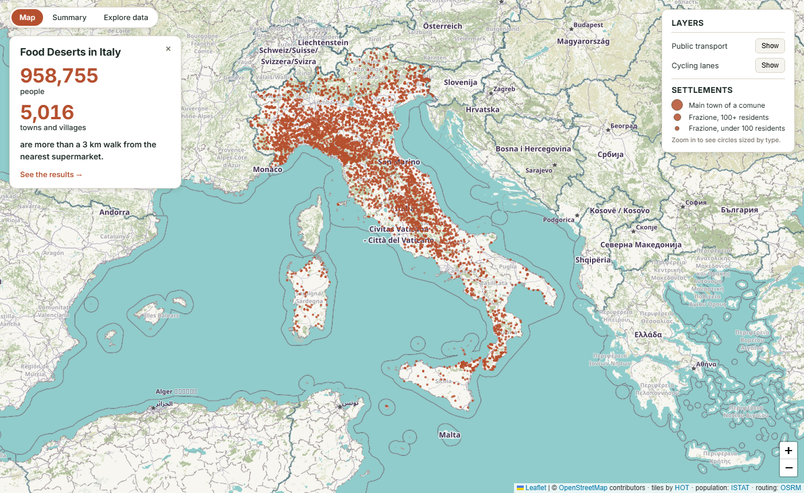
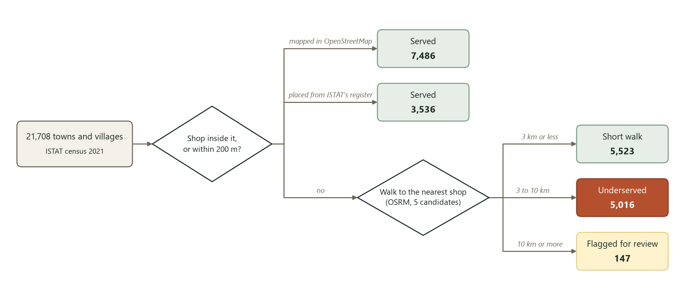
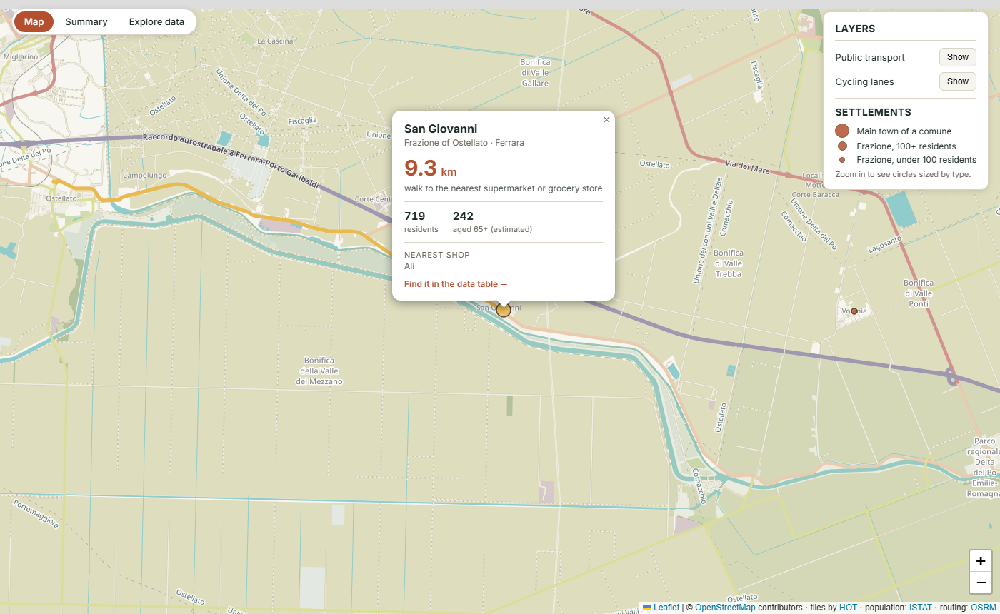
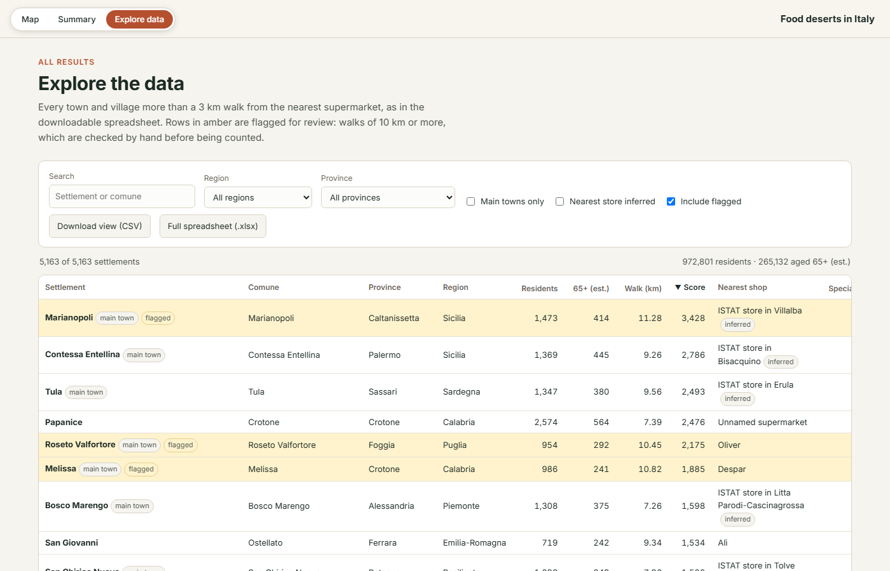
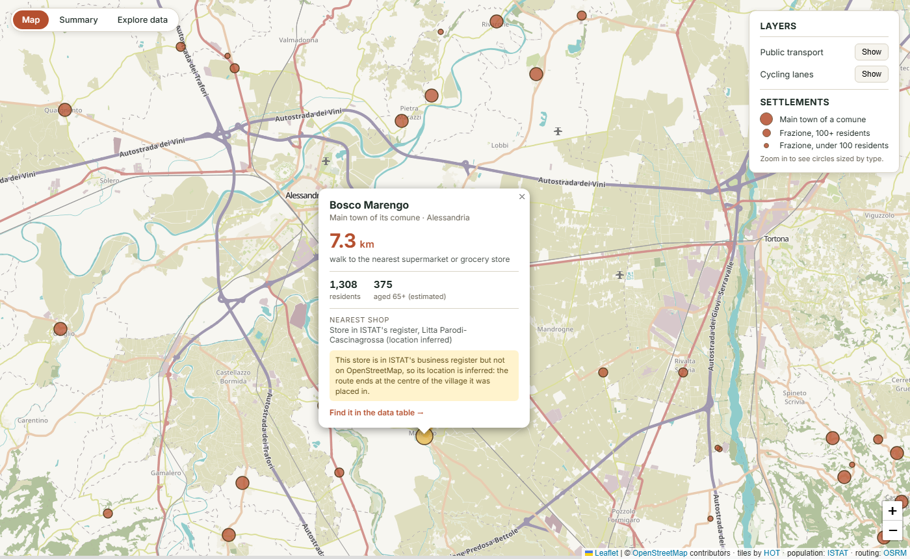
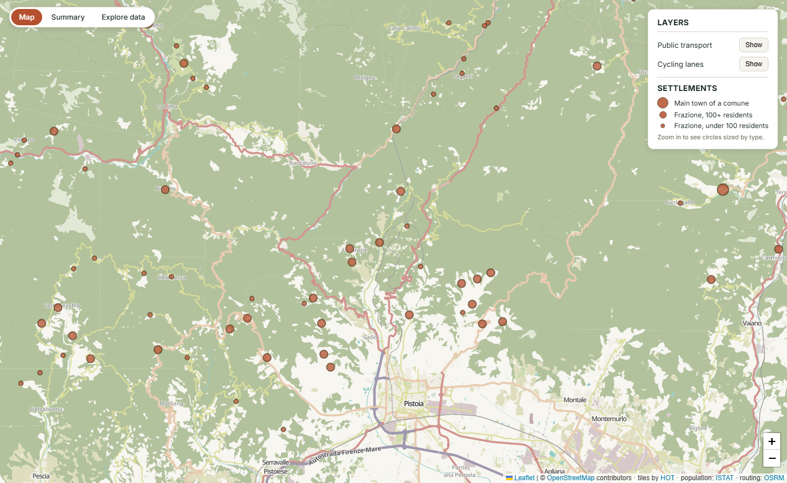
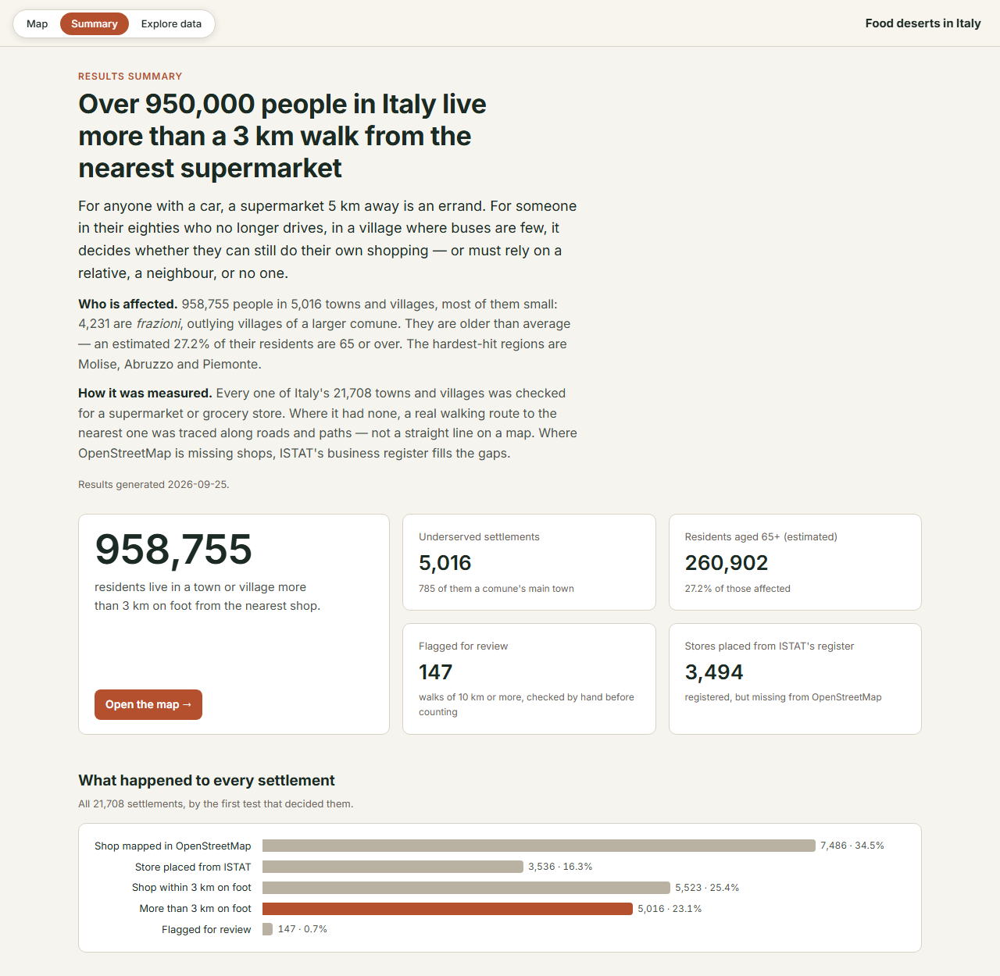

<h1 align="center">Food deserts in Italy</h1>

<p align="center">
  <strong>Which towns and villages are more than a walk from the nearest supermarket?</strong><br>
  Every town and village in Italy, measured by a real walking route to its nearest grocery store.
</p>

<p align="center">
  <a href="https://riccardoperana.github.io/Food-Deserts-Analysis-Italy/"></a>
  <a href="https://riccardoperana.github.io/Food-Deserts-Analysis-Italy/summary.html"></a>
  <a href="https://riccardoperana.github.io/Food-Deserts-Analysis-Italy/explore.html"></a>
</p>

<p align="center">
  <a href="LICENSE"></a>
  <a href="https://www.python.org/"></a>
  <a href="#data-sources"></a>
</p>

<p align="center">
  
</p>

## At a glance

| | |
|---|---|
| **958,755** residents | live in a town or village more than **3 km on foot** from the nearest supermarket or grocery store |
| **5,016** settlements | 785 of them a comune's main town, 4,231 of them frazioni |
| **260,902** aged 65+ | **27.2%** of those affected, against 24.7% for Italy as a whole (estimated) |
| **21,708** analysed | every town and village ISTAT records, in all 7,894 comuni |

<sub>Population figures are ISTAT's for 2024. Shops come from OpenStreetMap, plus
3,494 stores that ISTAT's business register counts but OpenStreetMap does not
map, placed in the settlements most likely to hold them — see
[How it works](#how-it-works).</sub>

**Contents** —
[Why this matters](#why-this-matters) ·
[How it works](#how-it-works) ·
[The website](#the-website) ·
[Challenges and how we solved them](#challenges-and-how-we-solved-them) ·
[Data sources](#data-sources) ·
[Run it yourself](#run-it-yourself) ·
[Known limitations](#known-limitations) ·
[What it found](#what-it-found)

---

## Why this matters

Italy has one of the world's oldest populations, and the skew is sharpest in
small towns that younger residents have left.

For a mobile adult with a car, a 6 km trip for groceries is an errand. For
someone in their eighties who no longer drives, it is the difference between
independence and dependence — on a relative, a neighbour, or nothing.

This project began from a small local observation: some towns have no shop, the
nearest one is in the next town over, and the road between them often has no
sidewalk, no cycle lane and no useful bus. That is easy to notice about one
town. It is impossible to check by hand across a thousand.

**Distance alone is not the finding.** A commuter town of 4,000 with a median
age of 38 and a mountain village of 400 where a third of residents are over 75
are not the same problem. Every result here is weighted by the number of
residents aged 65 or over, so the ranking reflects where the burden is
*largest*, not merely where it is most extreme.

---

## How it works

The unit of analysis is the **settlement**: every town and village ISTAT
records as a *centro abitato* — 21,708 of them, home to 91% of residents.
A settlement is reported as underserved when **both** conditions hold:

1. **It has no supermarket or minimarket of its own** — none inside its ISTAT
   outline or within 200 m of it.
2. **The routed walking distance from it to the nearest reachable shop
   exceeds 3 km.**

<p align="center">
  
</p>

### Why settlements, not comuni

Comuni vary in size by region far more than by anything to do with shops. A
Tuscan comune averages 66 km² and several villages; a Piedmontese one 14 km²
and usually one. Analysed comune by comune, Emilia-Romagna, Toscana and Puglia
looked almost fully served — a village far from its main town was hidden
inside a comune whose main town has a shop — while Piemonte, where each
village is its own comune, looked like the worst region in Italy by far.
Measuring every settlement the same way removes that distortion.

Settlement outlines and 2021 populations come from ISTAT's *Basi territoriali*.
Each settlement keeps its 2021 share of its comune's residents, applied to the
2024 figures. ISTAT does not publish ages per settlement, so residents 65+ are
estimated from the comune's 2024 share. Hamlets (*nuclei abitati*, median 26
residents) and scattered houses are not analysed.

### Filling OpenStreetMap's gaps with ISTAT's shop register

OpenStreetMap is the only source of shop *locations*, and in parts of Italy it
is far from complete. Poggiomarino (22,600 residents) has no supermarket in
OSM; ISTAT's register of business locations lists 34. Nationally, OSM maps
about half the stores the register counts, and as few as a third in Puglia,
Molise and Basilicata.

The register (ISTAT ASIA, local units by comune, 2023) gives counts per comune,
not addresses. Where it lists more general food stores (ATECO 471:
supermarkets, discounters, minimarkets, grocers) than OSM maps in a comune,
the missing ones are **placed** in its settlements that have no mapped shop:
the main town first, then the largest villages, one store each. A village
other than the main town only receives one if a store would be expected there
— the comune's store count times the village's share of its residents must
be at least 0.5 — otherwise a town's unmapped stores would be spread across
every hamlet around it.

A placed store then counts like any other shop: its settlement is served, and
neighbouring settlements can be routed to it. Every placement is listed in
`output/inferred_stores.json`, and the map and spreadsheet say when a
settlement's nearest shop is one of them.

Specialist food shops (ATECO 472: bakers, butchers, greengrocers) do not make
a grocery and are not placed; the spreadsheet notes how many a main town's
comune has.

### Why 3 km

Three kilometres is roughly half an hour's walk for an elderly person. There
and back is an hour — which is also the typical frequency of extra-urban buses
in rural Italy.

Past that point, walking stops being the sensible option: you would have been
better off waiting for the bus. The threshold marks where a walk stops being a
walk and becomes a journey that has to be planned around a timetable.

### Why routed distance, not straight-line

Papozze, on the Po delta, has a shop 2.8 km away in a straight line. It is on
the far bank, with no bridge nearby: the real walking route is **28.7 km**. A
different shop 7.1 km away straight-line is reachable in about 8 km on foot.

Straight-line proximity is not access. Every distance here is a real pedestrian
route computed by [OSRM](http://project-osrm.org/) over the actual road and
path network. The pipeline routes to the **five** nearest candidate shops and
keeps the shortest genuine walk, precisely so that an unreachable neighbour
cannot masquerade as the closest one.

### Why an equal-area projection

Distances are computed in EPSG:3035 (ETRS89 / LAEA Europe), in metres. Measuring
in raw latitude/longitude degrees inflates east–west distances by roughly 44% at
this latitude, which is enough to pick the wrong nearest shop.

### What is flagged rather than reported

Results at or beyond 10 km are flagged for manual review and excluded from the
headline figures and the map, though they remain in the spreadsheet as a full
audit trail. Remote mountain towns genuinely can be that far from a shop — but
so can a routing artefact, and the two are indistinguishable without checking.
147 of the 5,163 results are currently flagged.

---

## The website

The [live site](https://riccardoperana.github.io/Food-Deserts-Analysis-Italy/)
has three pages, switched from the top-left corner of each:

- **Map** — every underserved settlement: a dot when zoomed out, and zoomed in
  a circle sized by type (a comune's main town, or a frazione above or below
  100 residents). Click one to draw its walking route and see its figures.
  Cycle lanes and public transport can be overlaid, to judge by eye whether any
  safe infrastructure follows the route.
- **Summary** — the headline figures, what happened to every settlement, the
  regional picture, how far people have to walk, and the most affected places.
- **Explore data** — every result in a searchable, sortable table, filterable by
  region, province and type, with a CSV of the current view and the full
  spreadsheet to download. Each row links to its place on the map.

<p align="center">
  
</p>
<p align="center">
  <em>San Giovanni, a frazione of Ostellato (Ferrara): 719 residents, 9.3 km on
  foot from the nearest supermarket.</em>
</p>

<p align="center">
  
</p>

---

## Challenges and how we solved them

The project began as a study of three north-eastern regions. Taking it to the
whole of Italy broke almost every assumption the first version made. These are
the problems that mattered, and what was done about each.

### 1. Scaling from three regions to a whole country

**The problem.** Town boundaries used to be requested from Nominatim one name
at a time, at its limit of one request per second: over two hours for Italy.
Worse, a name search returns whichever same-named place ranks first, and Italy
has dozens of comuni sharing a name. The routing graph for Italy's entire
footpath network also has to fit on a 16 GB machine.

**The solution.** All 7,909 boundaries are now assembled directly from the
OpenStreetMap extract, in two passes, and every town is keyed by its OSM
relation ID rather than its name. The index of node coordinates that this
needs (about 4.5 GB) is kept on disk rather than in RAM, so the analysis runs
alongside the routing server. The OSRM walking graph for Italy took about two
hours to build and peaked at 11.9 GB of RAM, which fits once Docker's WSL 2
memory limit is raised (see *Requirements*).

### 2. Matching every comune to ISTAT's population data

**The problem.** A national join exposed failures that three regions never hit:

- **Names repeat.** Two Castro, two Livo, two Samone: matching by name hands one
  comune the other's population.
- **A comune called None.** There is a comune named None, near Turin. pandas
  reads that text as a missing value, and the parser stopped there, silently
  dropping 304 of Piemonte's 1,180 comuni.
- **Liguria.** ISTAT's published Liguria workbook has no per-comune tables at
  all, only province summaries.
- **Mergers.** Castegnero and Nanto merged into Castegnero Nanto, and Lirio into
  Montalto Pavese, after ISTAT's reference date: OpenStreetMap has the new
  comune, while ISTAT's tables still list the old ones.
- **Broken map data.** Pietramelara's boundary in OpenStreetMap had lost its name.

**The solution.** Comuni are matched on the six-digit ISTAT code they carry in
OpenStreetMap (`ref:ISTAT`), with names only as a fallback that refuses to
guess. The workbooks are read with missing-value detection turned off. Liguria
comes from ISTAT's POSAS publication, which agrees with the workbooks exactly
on all 7,358 comuni both cover. Merged comuni are summed from their
predecessors (`COMUNE_MERGERS`), and a comune without a name is kept by its
code and named from ISTAT. Every one of the 7,894 comuni now matches.

### 3. OpenStreetMap is missing shops

**The problem.** The first national run put Turi (13,000 residents) and
Poggiomarino (22,600) at the top of the list, with no supermarket at all. A
direct scan of the extract confirmed that this was not a bug: OpenStreetMap
simply has no shops mapped there. Nationally it maps about half the stores
that ISTAT's business register counts, and in some southern regions a third.

A first fix dropped every comune where the register listed a store. That
worked, but split the analysis in two: exact shop locations where
OpenStreetMap was complete, and bare per-comune counts where it was not.

**The solution.** The register's missing stores are now **placed**: in the
comune's main town first, then in its largest villages, but only where a store
would be expected. They are then treated like any other shop, so a village can
be served by one, or routed to one. 3,494 stores were placed this way; each is
listed in `output/inferred_stores.json`, and the map says when a settlement's
nearest shop is one of them.

<p align="center">
  
</p>
<p align="center">
  <em>Bosco Marengo's nearest store is in ISTAT's register but not on
  OpenStreetMap, and the map says so.</em>
</p>

### 4. The comune was the wrong unit to measure

**The problem.** Comuni differ enormously in size from region to region. A
Tuscan comune averages 66 km² and several villages; a Piedmontese one 14 km²
and usually just one. Asking whether a *comune* had a shop made Emilia-Romagna
and Toscana look almost fully served (3 underserved comuni each), because any
village far from its main town was hidden inside a comune that had a
supermarket somewhere. Piemonte, where each village is its own comune, looked
by far the worst region in Italy.

**The solution.** The analysis now measures every **settlement** (ISTAT's
*centri abitati*: 21,708 towns and villages) with the same test, using ISTAT's
2021 settlement outlines. Emilia-Romagna goes from 3 underserved comuni to 758
underserved settlements, and Toscana from 3 to 622.

<p align="center">
  
</p>
<p align="center">
  <em>Pistoia is a provincial capital with plenty of supermarkets, so as a
  comune it counted as served. Twenty of its frazioni in the hills to the north
  are more than a 3&nbsp;km walk from one.</em>
</p>

### 5. Populations for places ISTAT does not count by age

**The problem.** ISTAT publishes each settlement's population only for the
2021 census, and no ages at all.

**The solution.** Each settlement keeps its 2021 share of its comune's
residents, applied to the 2024 figures; residents aged 65+ are estimated from
the comune's share, and labelled as estimates everywhere. Ten settlements are
filed by ISTAT under a neighbouring comune but lie inside another today; they
take the national 2021-to-2024 change instead of being left without a
population. One of them, Succivo, has 8,542 residents.

### 6. A national map in a web browser

**The problem.** Five thousand settlements, their walking routes, and about
100 MB of cycle-lane and transport overlays are far too much for a web page to
load and draw at once.

**The solution.**

- **Overlays are gridded.** They are split into small files, and the map fetches
  only the ones in view.
- **Drawing is fast.** Markers and lines are drawn on a canvas, and routes are
  simplified to 3 m precision.
- **The markers adapt to zoom.** Zoomed out, every settlement is a small dot, so
  the national pattern stays readable; zoomed in, circles are sized by type.
- **Links go straight to a place.** Rows in the summary and the data table link
  to a place on the map, zoomed to show its whole route.

---

## Data sources

| Source | Used for | Licence |
|---|---|---|
| [OpenStreetMap](https://www.openstreetmap.org/copyright) (Geofabrik extract) | Town boundaries, shop locations, cycle lanes, transport routes | ODbL |
| [ISTAT](https://www.istat.it) — 2024 regional census | Population, age structure, ageing index | CC BY 4.0 |
| [ISTAT POSAS](https://demo.istat.it/app/?i=POS&l=it) — population at 1 January 2025 | The same census count, for Liguria (see below) | CC BY 4.0 |
| [ISTAT ASIA](https://esploradati.istat.it/databrowser/) — local units by comune, 2023 | Stores OSM has not mapped (see above) | CC BY 4.0 |
| [ISTAT Basi territoriali](https://www.istat.it/notizia/basi-territoriali-e-variabili-censuarie/) — localities, census 2021 | Settlement outlines and populations | CC BY 4.0 |
| [OSRM](http://project-osrm.org/) | Pedestrian routing | BSD |

ISTAT files are read **exactly as published**, with no manual editing —
download the same files (`python tools/download_istat.py`) and you regenerate
the same numbers.

Towns are matched to ISTAT by the six-digit ISTAT code that Italian comuni
carry in OpenStreetMap (`ref:ISTAT`), not by name: Italy has several pairs of
comuni sharing a name (two Castro, two Livo, two Samone…), and a name-only
match would give one of each pair the other's population.

**Liguria.** ISTAT's published Liguria workbook contains no per-comune tables —
only province-level summaries. Liguria's 234 comuni are therefore taken from
POSAS, ISTAT's own publication of the same census count by comune and age.
Checked against the workbooks across every one of the 7,358 comuni both cover,
the two agree exactly on population and on residents aged 65+.

All geographic data is read from a local OpenStreetMap extract rather than live
web queries, so it does not depend on the availability of free public query
servers. The only network calls are a Nominatim request for the outline of the
study area itself, and — only if a comune's boundary is broken in the extract —
one per such comune, looked up by its OSM relation ID.

---

## Run it yourself

### Requirements

For the whole of Italy (the default). The three-region study needs roughly a
quarter of each figure.

- **Python 3.9+**
- **Docker** (runs the OSRM routing engine). On Windows, Docker Desktop with
  the WSL 2 backend.
- **~40 GB free disk space** — the 2.1 GB Italy extract, 10–15 GB of OSRM
  routing graph plus temporary files while it builds, and up to ~9 GB of
  temporary node index in `%TEMP%` during a run (removed automatically)
- **16 GB of RAM**, with the WSL 2 memory limit raised (below)
- Windows, macOS or Linux. Commands below use PowerShell; adjust for your shell.

> ### ⚠️ Memory: the OSRM build is the constraint
>
> **Building the routing graph** for Italy's foot network is the heaviest step
> by far — an estimated 8–12 GB at its peak. On Windows, WSL 2 caps Docker at
> **half your RAM** by default, which is not enough on a 16 GB machine. Raise
> it by creating `%UserProfile%\.wslconfig`:
>
> ```ini
> [wsl2]
> memory=12GB
> swap=16GB
> ```
>
> then run `wsl --shutdown` and restart Docker Desktop. Close the browser and
> other large applications while the graph builds. If `osrm-extract` still
> exits with code 137 (killed for memory), see *Slimming the extract* below.
>
> **Reading the extract in Python** needs an index of every node coordinate —
> around 4.5 GB for Italy. By default it is kept in a temporary file on disk
> rather than in RAM (`OSMIUM_NODE_INDEX = "sparse_file_array"`), so the
> analysis runs comfortably alongside the OSRM server. On a machine with RAM to
> spare, `"flex_mem"` is faster.


### Quick start

```powershell
git clone https://github.com/RiccardoPerana/Food-Deserts-Analysis-Italy.git
cd Food-Deserts-Analysis-Italy

python -m venv venv
.\venv\Scripts\Activate.ps1
pip install -r requirements.txt
```

**1. Download the map extract** (2.1 GB) into `data/osm/`:

```powershell
New-Item -ItemType Directory -Force data\osm | Out-Null
Invoke-WebRequest -Uri "https://download.geofabrik.de/europe/italy-latest.osm.pbf" `
                  -OutFile "data\osm\italy-latest.osm.pbf"
```

**2. Download the ISTAT data** into `data/istat/`, then check it loads:

```powershell
python tools\download_istat.py
python run.py istat      # expect 7,894 comuni, 107 provinces, 58,943,464 residents
```

That fetches the 21 regional workbooks of the
[2024 census release](https://www.istat.it/comunicato-territoriale/censimento-della-popolazione-dati-regionali-anno-2024/)
(Trentino-Alto Adige is published as two), the two POSAS files that cover
Liguria, ISTAT's shop register, and the settlement outlines (`Localita_21.zip`,
255 MB). Workbook filenames do not matter — every
`.xlsx` in the folder is loaded. ISTAT publishes 7,896 comuni; two mergers
since then (`COMUNE_MERGERS`) bring that to 7,894.

ISTAT's data API is slow and sometimes stops answering for a while; if the
shop register fails, re-run the script later — it skips what is already there.

**3. Build the routing graph** (one-off; roughly 1–2 hours for Italy). From the
project root:

```powershell
docker run -t -v "${PWD}/data/osm:/data" ghcr.io/project-osrm/osrm-backend osrm-extract -p /opt/foot.lua /data/italy-latest.osm.pbf
docker run -t -v "${PWD}/data/osm:/data" ghcr.io/project-osrm/osrm-backend osrm-partition /data/italy-latest.osrm
docker run -t -v "${PWD}/data/osm:/data" ghcr.io/project-osrm/osrm-backend osrm-customize /data/italy-latest.osrm
```

**4. Start the routing server** in its own terminal, and leave it running:

```powershell
docker run -t -i -p 5000:5000 -v "${PWD}/data/osm:/data" ghcr.io/project-osrm/osrm-backend `
    osrm-routed --algorithm mld /data/italy-latest.osrm
```

**5. Check everything is in place, then run:**

```powershell
python run.py paths      # every input should read OK
python run.py all        # analyse, build map layers, publish
python run.py serve      # preview at http://localhost:8000
```

The first `analyze` builds the town and supermarket caches from the extract —
roughly 30–45 minutes for Italy, most of it assembling ~7,900 comune
boundaries. Every run after that takes a few minutes. `layers` re-reads the
extract each time (~10–20 minutes). The analysis checks at startup that the
routing server is running *and* that it was built from an extract covering the
study area, and stops with an explanation if not.

#### Slimming the extract

If the OSRM build runs out of memory, build it from a copy of the extract that
keeps only what the foot profile can route over — roughly halving its size.
This uses `osmium-tool` in a throwaway Debian container:

```powershell
docker run --rm -v "${PWD}/data/osm:/data" debian:bookworm-slim sh -c `
  "apt-get update -qq && apt-get install -y -qq osmium-tool >/dev/null && osmium tags-filter /data/italy-latest.osm.pbf w/highway w/route=ferry w/railway=platform w/public_transport=platform w/man_made=pier w/amenity=parking,parking_entrance w/leisure=track -o /data/italy-routing.osm.pbf --overwrite"
```

Build the graph from `italy-routing.osm.pbf` instead (the files become
`italy-routing.osrm.*`, so use that name in steps 3–4 and set
`OSRM_DATASET_PATH` accordingly). Keep `italy-latest.osm.pbf` — the analysis
itself still reads the full extract.

#### Running the original three-region study

Set `TARGET_LEVEL = "multi_region"` and `OSM_EXTRACT_NAME = "nord-est-latest"`
in `food_desert/config.py`, download
[nord-est-latest.osm.pbf](https://download.geofabrik.de/europe/italy/nord-est-latest.osm.pbf),
and build the routing graph from it. Each study area keeps its own caches, so
switching back and forth never loads the wrong one.


### Commands

| Command | What it does |
|---|---|
| `python run.py analyze` | Run the analysis → `output/` |
| `python run.py layers` | Build cycle-lane and transport overlays |
| `python run.py publish` | Copy results into `docs/data/` for the live demo |
| `python run.py serve` | Preview the site — map, summary and data pages — exactly as it will be published |
| `python run.py diagnose "Town Name"` | Spot-check one town against cached and live data (a six-digit ISTAT code picks one of several same-named towns) |
| `python run.py paths` | Show resolved paths and verify inputs exist |
| `python run.py istat` | Load the ISTAT data and report what was found, in seconds |
| `python run.py all` | analyse → layers → publish |

Publishing is deliberately separate from analysis, so an experimental run
cannot silently become the live demo.


### Output

- `output/food_desert_towns.xlsx` — every underserved settlement, sorted by
  vulnerability, with its comune, population, estimated 65+ count, ageing
  index, distance, review flags and notes
- `output/towns.geojson`, `output/routes.geojson` — map data
- `output/meta.json` — the study area's name and extent; the web map frames
  itself from it, so the page hardcodes no region
- `output/cycling_lanes/`, `output/public_transport/` — the overlays, split
  into a grid of small files that the map fetches only for the area in view
- `output/unroutable_towns.json` — settlements with no walkable route to any candidate
- `output/inferred_stores.json` — every store placed from ISTAT's register,
  with the settlement it was placed in and the comune's register and OSM counts
- `output/results.json`, `output/summary.json` — the data behind the site's
  *Explore data* and *Summary* pages
- `docs/` — the published site: the map (`index.html`), a results summary
  (`summary.html`) and a searchable table of every result (`explore.html`)


### Configuration

Everything lives in `food_desert/config.py`.

| Setting | Purpose |
|---|---|
| `TARGET_LEVEL` / `TARGET_REGIONS` | Area to analyse — `"country"` (default) or `"multi_region"` |
| `OSM_EXTRACT_NAME` | Geofabrik extract to read, e.g. `italy-latest` or `nord-est-latest` |
| `DISTANCE_THRESHOLD_KM` | The "too far" cutoff — default 3 km |
| `SETTLEMENT_TYPES` | Which ISTAT localities are analysed — default `(1,)`, towns and villages; add `2` for hamlets |
| `SETTLEMENT_SHOP_BUFFER_M` | A shop this close to a settlement's outline serves it — default 200 m |
| `INFERRED_STORE_MIN_SHARE` | How likely a village must be to hold a register store before one is placed there — default 0.5 |
| `DISTANCE_REVIEW_THRESHOLD_KM` | Results at/beyond this are flagged for review — default 10 km |
| `ROUTING_CANDIDATE_COUNT` | How many nearby shops to route to before choosing — default 5 |
| `BORDER_BUFFER_KM` | How far past the study area to look for shops |
| `EXCLUDE_UNMATCHED_TOWNS` | Drop towns with no ISTAT match (i.e. outside the study area) |
| `COMUNE_MERGERS` | Comuni merged since the ISTAT reference date; their figures are summed |
| `OSMIUM_NODE_INDEX` | Node coordinates on disk (`sparse_file_array`) or in RAM (`flex_mem`) |
| `MAP_TILE_SIZE_DEG` | Grid cell size for the web map's overlays |
| `OSM_PBF_PATHS` | Extracts to read shops from; a list, so neighbouring countries can be added |
| `FORCE_REFRESH_CACHE` | Rebuild everything from scratch |

Caches are named after the study area (`data/cache/towns_country-it.gpkg`), so
changing `TARGET_LEVEL` can never silently reuse another area's data.

Settings marked `# SCALE HOOK` are deliberate extension points, not dead code.
Each states what work activating it requires.

---

## Known limitations

- **The national border.** The Italy extract stops a short way past the
  border. A town on the edge whose nearest shop lies across it — in France,
  Switzerland, Austria, Slovenia, San Marino or the Vatican — may not see it.
  Borders between Italian regions are fully handled. Closing the gap means
  adding the neighbouring extracts to `OSM_PBF_PATHS` *and* merging them into
  the routing graph.
- **Inferred store locations.** Where OSM misses stores, their settlement is
  inferred from the register's per-comune count, not known. The rule is
  deliberately conservative outside main towns, but a store can still be
  placed in the wrong village, or a real one missed; a shop that opened after
  2023 is in neither source. Distances to an inferred store are measured to
  the centre of the settlement it was placed in.
- **Ages are estimated.** ISTAT publishes no age breakdown per settlement, so
  each settlement's residents 65+ use its comune's share. A village that is
  older than its comune's average is under-counted, and vice versa.
- **Hamlets are not analysed.** *Nuclei abitati* (1.7 M residents, median 26
  per hamlet) and scattered houses (3.4 M) are left out; some of the most
  isolated residents live there.
- **Comuni merged since 2024.** A merger after the ISTAT reference date
  (31 December 2024) shows up in OpenStreetMap as one boundary but in the
  census tables as its predecessors. Known mergers are listed in
  `COMUNE_MERGERS` and summed; a new one appears in the run's log as ISTAT
  comuni with no matching town, and needs a line there.
- **Same-named comuni without an ISTAT code in OSM.** Matching is by ISTAT
  code; the name is only a fallback. Where OSM carries no code *and* the name
  belongs to several comuni, the town is left unmatched rather than guessed —
  and listed.
- **Extra-urban public transport is absent** from the map. OpenStreetMap covers
  urban bus routes well and regional coach networks poorly; closing that gap
  means stitching together feeds from each regional operator.
- **Data is a snapshot.** OpenStreetMap changes constantly. Re-download the
  extract periodically.
- **No automated pavement or cycle-lane check.** Rather than a pass/fail test on
  infrastructure quality, the map renders the cycle-lane layer over each town's
  route so it can be judged by eye.

---

## Licence

MIT — see [LICENSE](LICENSE). Map data © OpenStreetMap contributors (ODbL);
population and business data © ISTAT (CC BY 4.0).

---

## What it found

**Nearly a million people** — 958,755 — live in one of 5,016 towns and villages
whose nearest supermarket or grocery store is more than a 3 km walk away. Most
of those places are small: half have fewer than 100 residents, and five in six
are frazioni rather than a comune's main town. They are also older than
average: an estimated 27.2% of their residents are 65 or over, against 24.7%
for Italy as a whole.

**Most are just past the line.** Half of the residents affected (49%) walk
3–4 km; 14% — 134,908 people — face 6 km or more.

**The central Apennines and the north-west are hit hardest; the south's compact
towns least.** Molise stands apart, with 9.0% of its residents affected,
followed by Abruzzo (4.2%), Piemonte (3.3%) and Umbria (3.2%). Puglia (0.2%),
Campania (0.4%) and Sicilia (0.5%) are lowest: people there live in large,
compact towns where a shop is rarely far. Puglia's settlements average about
3,600 residents each, the highest in Italy.

<details>
<summary><strong>All twenty regions</strong></summary>

| Region | Share of residents affected | Underserved settlements |
|---|--:|--:|
| Molise | 9.0% | 63 |
| Abruzzo | 4.2% | 276 |
| Piemonte | 3.3% | 674 |
| Umbria | 3.2% | 240 |
| Emilia-Romagna | 3.0% | 758 |
| Calabria | 3.0% | 211 |
| Toscana | 2.8% | 622 |
| Marche | 2.7% | 238 |
| Friuli-Venezia Giulia | 2.5% | 146 |
| Veneto | 2.3% | 362 |
| Liguria | 2.2% | 252 |
| Valle d'Aosta | 2.0% | 23 |
| Basilicata | 1.9% | 37 |
| Lombardia | 1.8% | 488 |
| Trentino-Alto Adige | 1.1% | 70 |
| Sardegna | 1.1% | 74 |
| Lazio | 0.7% | 202 |
| Sicilia | 0.5% | 119 |
| Campania | 0.4% | 119 |
| Puglia | 0.2% | 42 |

</details>

**Most affected**, ranked by residents aged 65+ times the kilometres beyond 3 km:

| Settlement | Comune | Residents | Aged 65+ (est.) | Walk |
|---|---|--:|--:|--:|
| Contessa Entellina | Contessa Entellina (PA), Sicilia | 1,369 | 445 | 9.3 km |
| Tula | Tula (SS), Sardegna | 1,347 | 380 | 9.6 km |
| Papanice | Crotone (KR), Calabria | 2,574 | 564 | 7.4 km |
| Bosco Marengo | Bosco Marengo (AL), Piemonte | 1,308 | 375 | 7.3 km |
| San Giovanni | Ostellato (FE), Emilia-Romagna | 719 | 242 | 9.3 km |

In Contessa Entellina, Tula and Bosco Marengo, neither OpenStreetMap nor
ISTAT's business register records a single supermarket or grocery store in the
whole comune — only a handful of bakers and butchers.

<p align="center">
  
</p>
